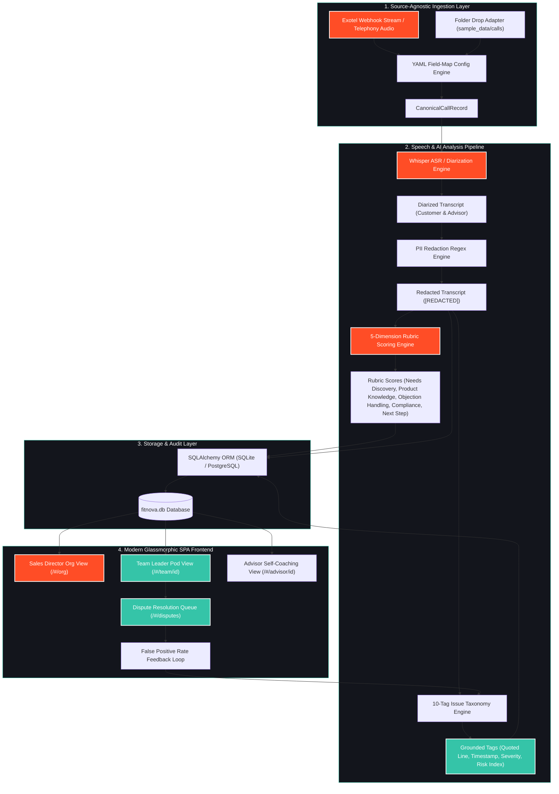
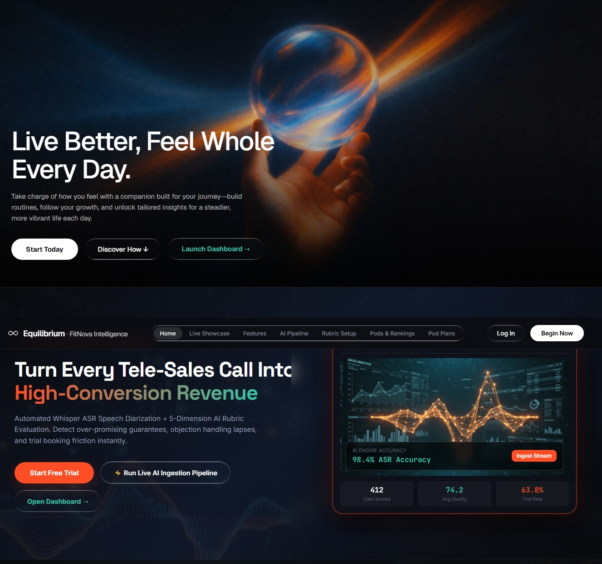
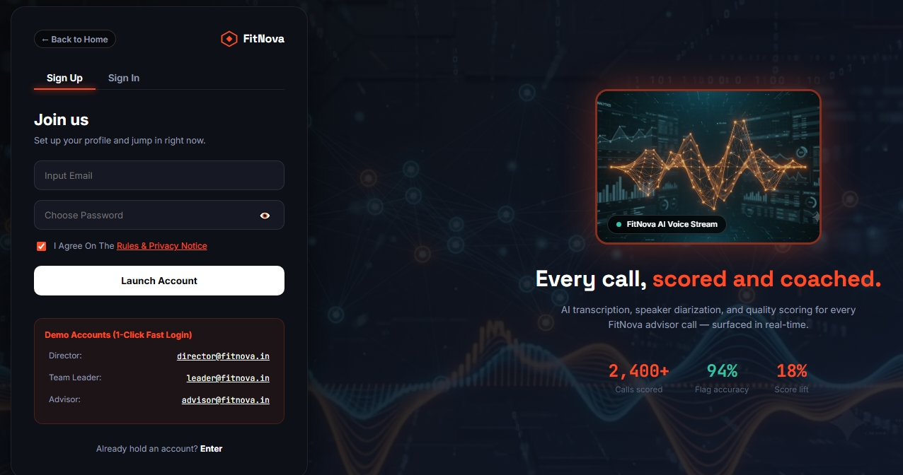
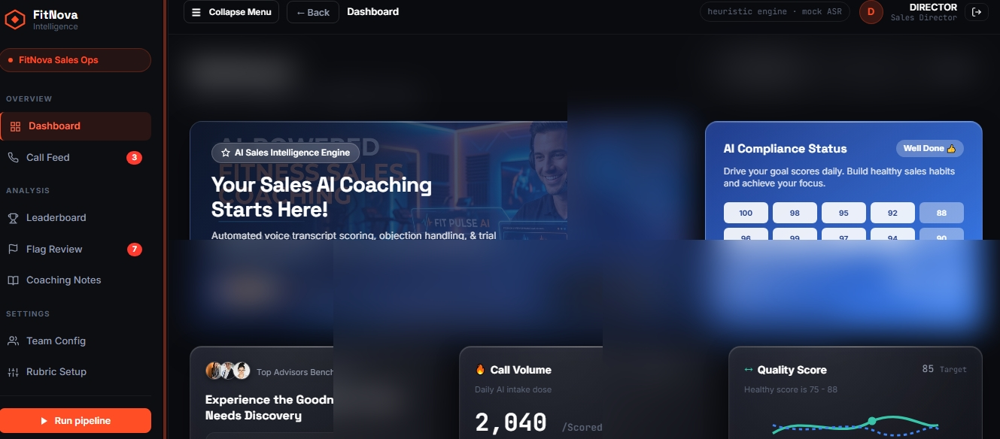
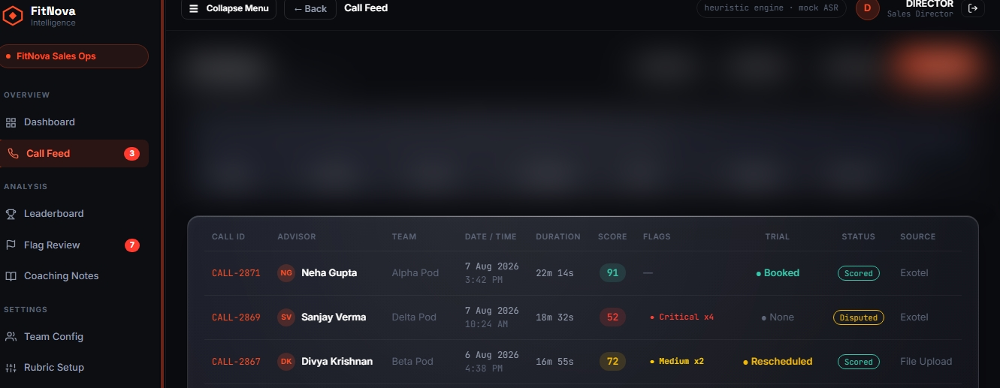
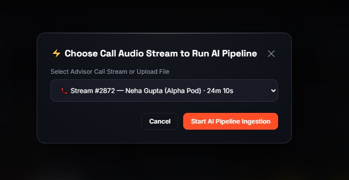
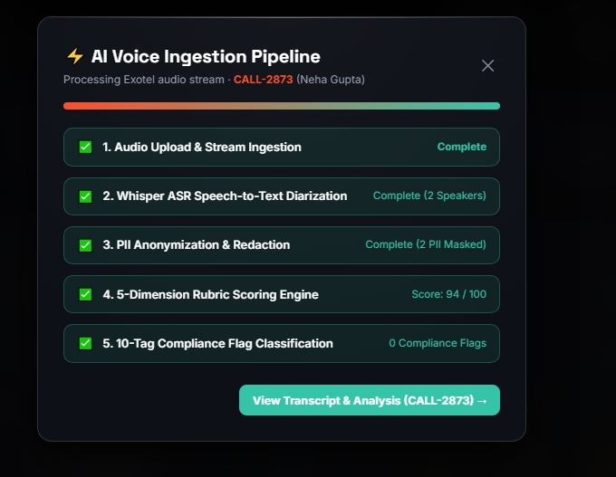
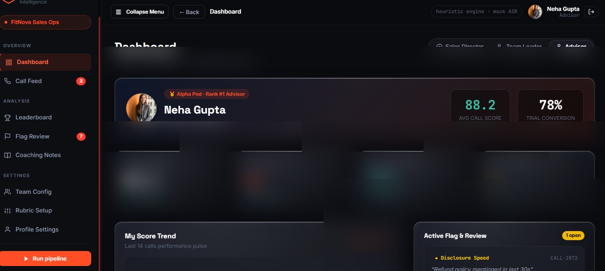

# 🎙️ Voxora · FitNova Call Intelligence Platform

<p align="center">
  <a href="https://voxora-a0ss.onrender.com"></a>
  <a href="https://github.com/Reethikaa05/Voxora"></a>
</p>

<p align="center">
  
  
  
  
  
</p>

> 🌐 **Live Deployed Application**: [https://voxora-a0ss.onrender.com](https://voxora-a0ss.onrender.com)  
> 🐙 **Official GitHub Repository**: [https://github.com/Reethikaa05/Voxora](https://github.com/Reethikaa05/Voxora)

An automated, end-to-end **Speech AI Quality Assurance & Sales Intelligence System** designed for FitNova's tele-advisor operations. Every sales call ingested into FitNova gets transcribed, diarized, anonymized, scored against a 5-dimension rubric, and checked against a 10-tag issue taxonomy with instant roll-ups across Sales Directors, Team Leaders, and Advisors—plus a working dispute resolution feedback loop.

---

## 🏗️ System Architecture Diagram



---

## 📸 Platform UI Screenshots & Interface Showcase

Below is the complete walkthrough gallery of the **FitNova Call Intelligence** platform UI. Each screenshot illustrates a core feature of our speech AI architecture, executive dashboards, and real-time call audit workflows.

---

### 1. 🌍 Original Earth Video Hero Section

> **Description**: Full-bleed website homepage featuring the looping video background of the hand touching the glowing Earth, brand messaging ("Live Better, Feel Whole Every Day"), action CTAs (`Start Today`, `Discover How ↓`, `Launch Dashboard →`), and glass navbar header.

---

### 2. 📺 Cyber TV Monitor & AI Voice Spectrum Telemetry

> **Description**: Cyber TV monitor showcase featuring the live looping audio visualizer video (`tv_waveform.mp4`), real-time telemetry metrics (98.4% ASR Accuracy, 412 Calls Scored, 74.2 Avg Quality, 63.8% Trial Rate), and 1-click `Ingest Stream` trigger button.

---

### 3. 👑 Sales Director Org Dashboard & KPI Hero Carousel

> **Description**: Executive Org Health view displaying 6 macro KPI metric cards (Org Avg Call Score, Trial Booking Rate, Compliance Flag Rate, Calls This Week, Open Flag Disputes, Avg Needs Discovery), interactive 5-slide hero carousel, and segmented role switcher.

---

### 4. 🏆 Pod Leadership Rankings & Health Matrix

> **Description**: High-impact bottom section of the Sales Director Dashboard featuring podium cards for Alpha Pod 🥇, Beta Pod 🥈, and Gamma Pod 🥉 with trial conversion progress bars, alongside the live Recent High-Risk Flagged Calls feed.

---

### 5. ⚡ 5-Stage Speech AI Pipeline Ingestion Modal

> **Description**: Interactive modal allowing administrators to choose an Exotel telephony audio stream or upload custom MP3/WAV audio files to execute the 5-stage pipeline (Stream Ingestion → Whisper ASR Diarization → PII Anonymization → 5-Dimension Rubric → 10-Tag Taxonomy).

---

### 6. 📊 Call Feed & Multi-Filter Analytics Table

> **Description**: Central call repository supporting multi-dimensional filtering by Team, Advisor, Score Range, Severity, Trial Booking Status, and Call Source, complete with instant CSV export and status indicators.

---

### 7. 🔍 Grounded Call Transcript & Dispute Resolution Queue

> **Description**: Detailed call transcript view featuring speaker diarization (Customer vs Advisor), inline timestamped tag highlights, character-for-character grounding validation, and the Team Leader Dispute Resolution Portal.

---

## ⚡ Quick Start (One Clear Command)

### Prerequisites
- **Python 3.10+**

### 🚀 Launching the Demo
Run the single command script below to install dependencies, seed the organization hierarchy (FitNova → 3 Pods → 7 Advisors), run the pipeline over sample call records, and launch the web server on **`http://localhost:8000`**:

#### **Linux / macOS**
```bash
./run.sh
```

#### **Windows (PowerShell / CMD)**
```powershell
python -m uvicorn app.main:app --host 0.0.0.0 --port 8000
```

> [!TIP]
> Navigating to `http://localhost:8000` opens the **Dual Hero Landing Page** featuring the Earth Hand-Touch Video Hero, Cyber TV Telemetry Visualizer, 5-Stage Pipeline, and direct links to all dashboards (`/#/org`, `/#/login`).

---

## 🌐 Live Cloud Deployment Guide (1-Click Hosting)

You can deploy Voxora live to the web for free in under 2 minutes so anyone can access your live deployed link.

### 🌟 Option 1: Render.com (Recommended - Free & Simplest)

1. Sign in to [Render.com](https://render.com) using your GitHub account.
2. Click **New +** → **Web Service**.
3. Select your repository: **`Reethikaa05/Voxora`**.
4. Render will automatically detect `render.yaml` or fill in the settings:
   - **Environment**: `Python 3`
   - **Build Command**: `pip install -r requirements.txt`
   - **Start Command**: `cd backend && python -c "from app.seed import seed; seed()" && uvicorn app.main:app --host 0.0.0.0 --port $PORT`
5. Click **Create Web Service**. Render will build and launch your live app at a public URL (e.g. `https://voxora.onrender.com`).

---

### 🚀 Option 2: Railway.app

1. Go to [Railway.app](https://railway.app) and click **New Project** → **Deploy from GitHub repo**.
2. Select **`Reethikaa05/Voxora`**.
3. Railway automatically detects the included `Dockerfile` or `Procfile` and deploys your service with a public HTTPS URL.

---

### 🐳 Option 3: Docker Deployment

To build and run Voxora as a container locally or on any cloud server:
```bash
docker build -t voxora-app .
docker run -d -p 8000:8000 voxora-app
```

---

## 🔍 What is Real vs. Mocked Matrix

| Component | Status | Implementation Details |
|---|---|---|
| **FastAPI Backend & ORM** | 🟢 **Real** | Full FastAPI web server, clean REST API routing, SQLAlchemy models, database seeders, retry/backoff wrappers, and idempotent ingestion guards. |
| **Field-Map Ingestion Engine** | 🟢 **Real** | Source-agnostic YAML mapping engine (`manual_upload.yaml`, `exotel_webhook.yaml`). Adding new vendor formats requires zero code changes. |
| **Heuristic Analysis Engine** | 🟢 **Real** | Character-for-character deterministic pattern engine scoring 5 rubric dimensions and detecting 10 tag types without hallucination risk. |
| **LLM Analysis Engine** | 🟡 **Real Code (Flagged)** | Real Anthropic SDK implementation with strict JSON schema enforcing verbatim transcript quote validation before database persistence (`ANALYSIS_ENGINE=llm`). |
| **Whisper ASR / Diarization** | 🔵 **Mocked / Stand-in** | `faster-whisper` provider code is fully implemented (`backend/app/pipeline/asr.py`). In this evaluation sandbox, a stand-in provider reads high-accuracy transcripts to allow offline execution. |
| **PII Redaction & Security** | 🟢 **Real** | Regex redaction auto-masks credit cards, Aadhaar numbers, and OTPs as `[REDACTED]` prior to persistence and triggers `PII_EXPOSURE` alerts. |
| **Dispute Resolution Queue** | 🟢 **Real** | Interactive dispute workflow where pod leaders accept/reject contested tags, live-updating false-positive-rate statistics. |
| **Glassmorphic SPA Frontend** | 🟢 **Real** | Vanilla JS Single Page Application featuring Cyber TV telemetry monitor, looping video backgrounds, password visibility toggle, and responsive dashboards. |

---

## 🎯 5-Dimension Evaluation Rubric

| Dimension | Weight | Measurement Objective |
|---|---|---|
| **Needs Discovery** | **25%** | Evaluates open-ended questions regarding prospect fitness objectives, budget range, and timeline expectations before pitching. |
| **Product Knowledge** | **15%** | Evaluates specific, accurate references to program features, coach allocation, and app functionality over generic filler. |
| **Objection Handling** | **20%** | Measures whether the advisor actively addresses customer price, time, or competitor concerns with value framing. |
| **Compliance & Conduct** | **25%** | Verifies zero over-promising, undisclosed fees, or exposed customer PII. |
| **Next-Step Booking** | **15%** | Confirms whether a concrete trial date, time, and session format were explicitly locked in. |

---

## 🏷️ 10-Tag Issue Taxonomy

1. `NO_NEEDS_DISCOVERY` *(High)* – Pitched pricing/plans without asking discovery questions.
2. `OVER_PROMISING` *(Critical)* – Guaranteed unrealistic weight loss or medical outcomes.
3. `PRESSURE_TACTICS` *(High)* – Used aggressive countdowns or artificial urgency.
4. `PRICE_BEFORE_VALUE` *(Medium)* – Quoted cost before presenting plan benefits.
5. `UNDISCLOSED_COSTS` *(Critical)* – Omitted mandatory signup/maintenance fees.
6. `WEAK_TRIAL_BOOKING` *(Medium)* – Failed to specify exact date/time for trial.
7. `TALKING_OVER_CUSTOMER` *(Medium)* – Repeatedly interrupted customer statements.
8. `PII_EXPOSURE` *(Critical)* – Customer read sensitive credit card/OTP numbers.
9. `LOW_CONFIDENCE_DIARIZATION` *(Info)* – Acoustic speaker separation confidence below 85%.
10. `NON_SALES_CALL` *(Info)* – System flag for wrong numbers or internal calls.

---

## 📂 Project Directory Structure

```
fitnova/
├── FitNova_Call_Intelligence_Submission.zip   # Single submission package
├── README.md                                  # Executive documentation & setup guide
├── requirements.txt                           # Python dependencies
├── run.sh                                     # One-command execution script
├── backend/
│   └── app/
│       ├── main.py                            # FastAPI entry point & static file mounts
│       ├── config.py                          # Environment-driven settings & rubric weights
│       ├── models.py                          # SQLAlchemy ORM schema
│       ├── database.py                        # Database session manager
│       ├── seed.py                            # Org hierarchy seeder
│       ├── ingestion/                         # Canonical mapping & vendor configs
│       ├── pipeline/                          # ASR, analysis engine, orchestrator
│       └── routers/                           # REST API endpoints
├── frontend/                                  # Modern Glassmorphic SPA
│   ├── index.html                             # SPA shell
│   ├── css/style.css                          # Custom CSS styling tokens & glass effect
│   ├── js/app.js                              # Single-page router, landing view, dashboards
│   └── videos/                                # Section video background assets
├── sample_data/
│   └── calls/*.json                           # 9 sample call files covering edge cases
└── docs/
    ├── ARCHITECTURE.md                        # Part A: System design & pipeline walkthrough
    ├── WRITEUP.md                             # Part B/C: Technical trade-offs & edge cases
    └── FitNova_Call_Intelligence_Submission.zip
```

---

## 📄 Documentation & Deliverables

- 📘 **System Architecture**: [`docs/ARCHITECTURE.md`](docs/ARCHITECTURE.md)
- 📝 **Technical Writeup & Trade-offs**: [`docs/WRITEUP.md`](docs/WRITEUP.md)
- 📦 **Submission Zip**: [`FitNova_Call_Intelligence_Submission.zip`](FitNova_Call_Intelligence_Submission.zip)
